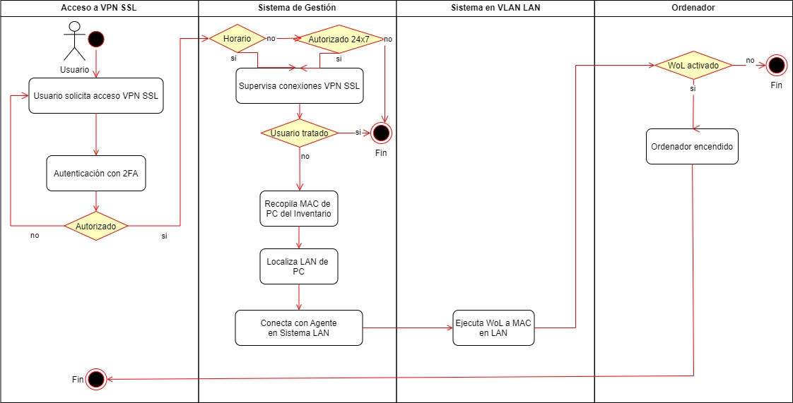
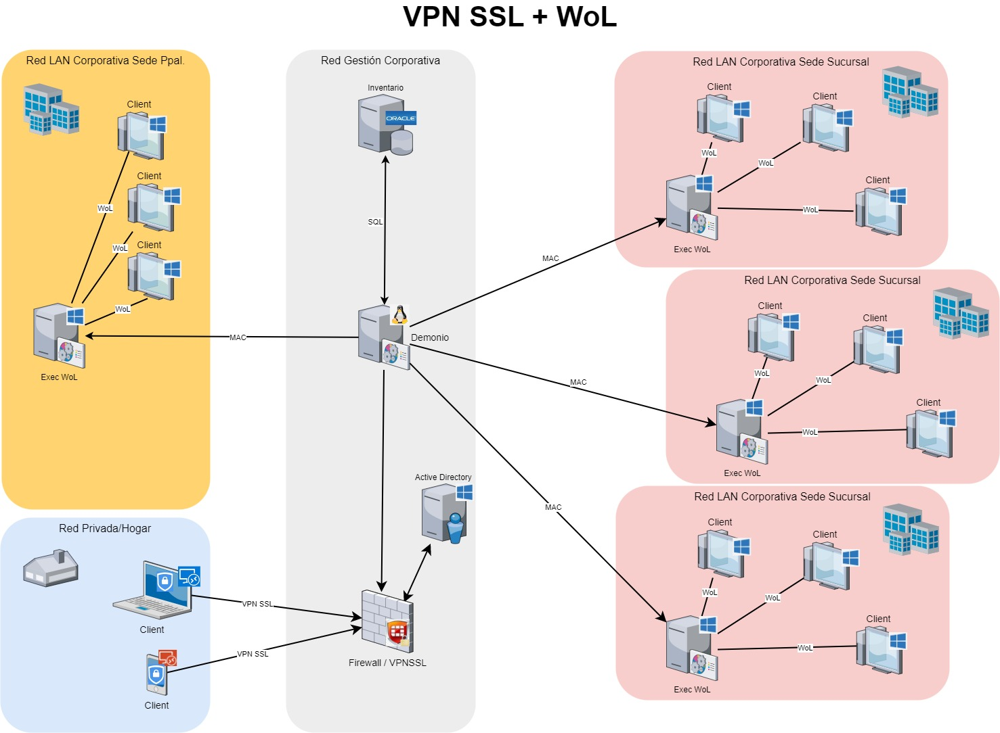
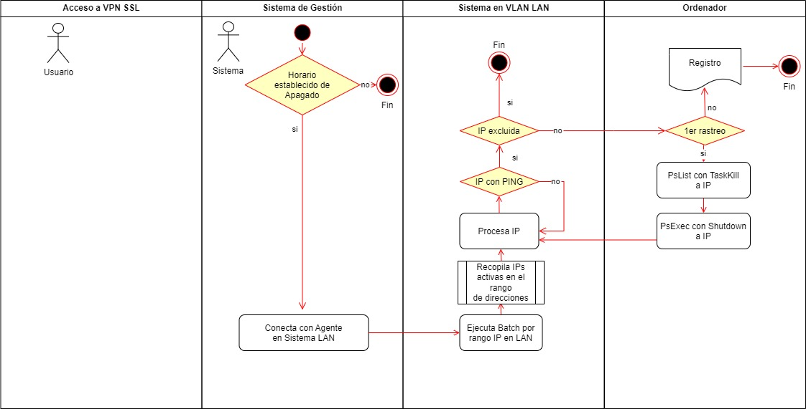
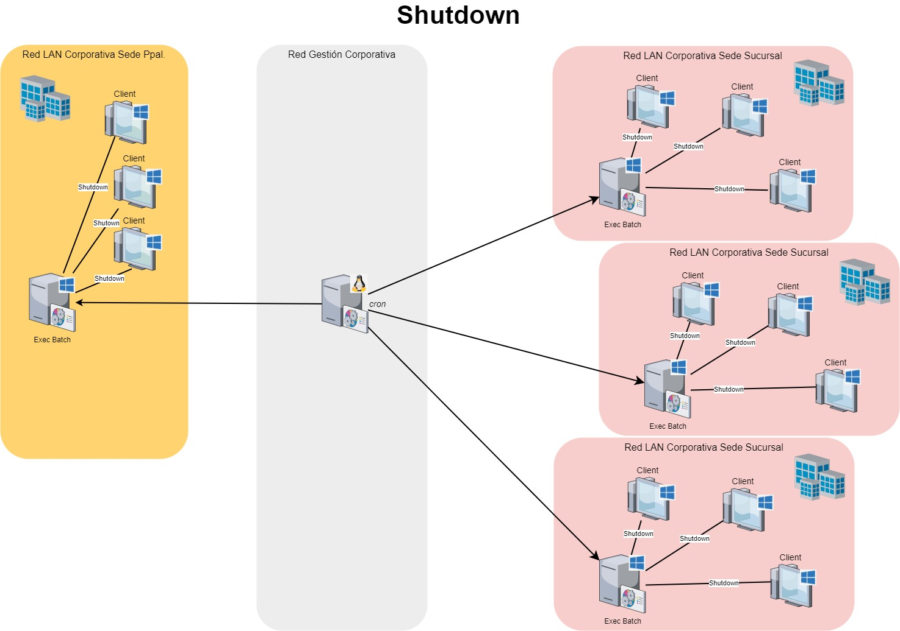
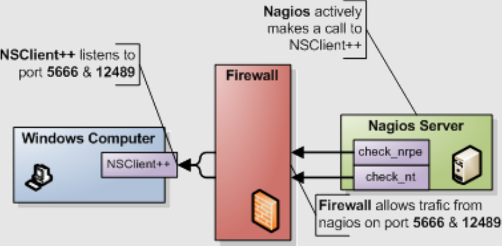

# TFG_GII-E_PER5784-2022-2023
<h3> Repositorio para el Trabajo Fin de Grado 2°Q (Grado de Ingeniería Informática) - PER5784 2022-2023 </h3>
<h5> UNIR - Universidad Internacional de La Rioja</h5>
 
<h4> <b>Título del Trabajo</b> 
 
Eficiencia energética en accesos corporativos a Escritorios Remotos con reutilización de recursos </h4>
<h3> <u>Alumno</u>: José Pizarro Medina</h3>
<h3> <u>Directora</u>: Belén Bermejo González</h3>
<h5> <u>Curso</u>: 2022-2023 </h5>
 
<h4> <b>Descripción del Proyecto</b></h4>

<h5> Dado la necesidad de implantar una solución de <b>Teletrabajo </b>en un entorno corporativo, se ha potenciado el reutilizar la solución nativa de MS Windows® de Escritorio Remoto (RDP), para acceder al puesto de trabajo remotamente. Para ello el ordenador personal (PC) corporativo necesita estar operativo, por lo que el consumo energético de dicho recurso pasa de ser un horario laboral (8x5) a elevarse a un horario continuo (24x7). Una vez terminada la jornada laboral, el dispositivo sigue estando operativo, cuando debería pasar a estar de nuevo inactivo, para que haya una buena eficiencia energética y <b><u>evitar</b></u>: limitar vida útil; contaminación lumínica; ruido; problemas de seguridad; etc.</h5>
 
<h4> <b> Diagrama de Actividad del Proceso de Encendido por <i>WoL</i> para conexión establecida VPN SSL</b></h4>

 
 
<h5> <b> Arquitectura del proceso VPN SSL + <i>WoL</i> </b></h5>

 

 
<h4> <b> Diagrama de Actividad del Proceso de Apagado</b></h4>

 
<h5> <b> Arquitectura del proceso de Apagado (<i>Shutdown</i>)</b></h5>

 

## Construido con 🛠️

_El desarrollo que se han utilizado para crear el trabajo_

* <b>Shell Script</b>
    * [encendido_pcs_vpns.sh](https://github.com/jopizmed/TFG_GII-E_PER5784-2022-2023/blob/main/encendido_pcs_vpns.sh) - Script de la Shell de Linux para el Proceso principal de Encendido
* <b>Batch Scripts</b>
    * [check_wol_pc.bat](https://github.com/jopizmed/TFG_GII-E_PER5784-2022-2023/blob/main/check_wol_pc.bat) - Script de Batch de Windows para el Proceso de Encendido por <i>WoL</i>
    * [lanza_apagado_pcs_LAN_SEDE01.cmd](https://github.com/jopizmed/TFG_GII-E_PER5784-2022-2023/blob/main/lanza_apagado_pcs_LAN_SEDE01.cmd) - Script de Batch de Windows para el Proceso de Apagado por <i>Shutdown</i>
* <b>SQL Scripts</b>
    * [PC_hab_MACs_ORACLE-PAN.sql](https://github.com/jopizmed/TFG_GII-E_PER5784-2022-2023/blob/main/PC_hab_MACs_ORACLE-PAN.sql) - Script en SQL para Oracle de lectura de Inventario (ITAM)

_Las herramientas Freeware que se han utilizado para crear el trabajo_
* [wol.exe](https://github.com/jopizmed/TFG_GII-E_PER5784-2022-2023/blob/main/wol.exe) - Ejecutable para lanzar <i>WoL</i> a un PC por dirección MAC
* <b> PSTools </b> - Kits de recursos de Windows para poder lanzar comandos remotamente
    * [PsList](https://github.com/jopizmed/TFG_GII-E_PER5784-2022-2023/blob/main/PSTools/pslist.exe) - Enumera información detallada sobre los procesos remotos
    * [PsExec](https://github.com/jopizmed/TFG_GII-E_PER5784-2022-2023/blob/main/PSTools/PsExec.exe) - Ejecución de procesos de forma remota
* <b> Agentes de Nagios </b> -Usados para la integración de los Procesos y la ejecución remota de comandos
    * [NSClient++](https://nsclient.org/#download-nsclient) - Agente que se pueden usar para monitorizar dispositivos Windows
    * [NRPE](http://assets.nagios.com/downloads/nagiosxi/agents/linux-nrpe-agent.tar.gz) - Agente para la máquina Linux
    
    
## Autor ✒️
* **José Pizarro Medina** - [jopizmed](https://github.com/jopizmed)

---
⌨️ con ❤️ por [jopizmed](https://github.com/jopizmed) 😊
